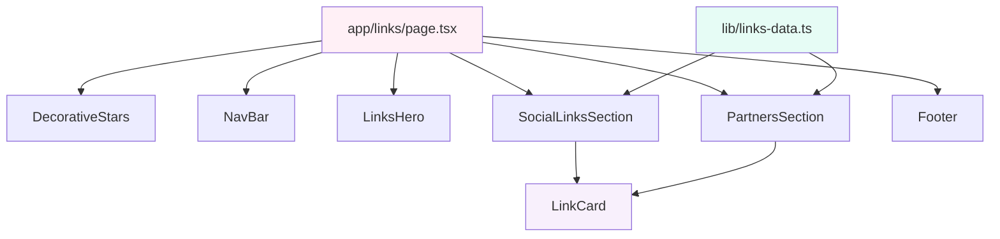

# Design Document: Links Page

## Overview

The Links Page is a Linktree-style directory page at `/links` that centralizes all of Faith's social media profiles and partner/sponsor links with promotional codes. It follows the established page pattern (DecorativeStars → NavBar → main → footer) and reuses the whimsical pastel design system already in place.

The page is entirely static with no server-side data fetching or dynamic content — all links are defined in a typed data file. This keeps the implementation simple, fast-loading, and easy to maintain.

### Key Design Decisions

1. **Static data file over CMS/database** — Links change infrequently, so a typed `lib/links-data.ts` file provides type safety, fast builds, and zero runtime cost. If dynamic management is needed later, the typed interfaces make migration straightforward.
2. **Single shared LinkCard component** — Both social and partner links render through the same `LinkCard` component with optional description support, reducing duplication.
3. **Existing page layout pattern** — Follows the identical DecorativeStars → NavBar → sections with sparkle-dividers → footer structure used by the portfolio page.

## Architecture



The page is a standard Next.js App Router page component that composes existing shared components (DecorativeStars, NavBar) with new feature-specific components. Data flows from the static data file into the section components, which map over arrays to render LinkCard instances.

## Components and Interfaces

### File Structure

```
app/links/page.tsx              — Page route component with metadata export
components/links/LinksHero.tsx  — Hero section with heading and tagline
components/links/LinkCard.tsx   — Reusable card for individual links
components/links/SocialLinksSection.tsx  — Social media links section
components/links/PartnersSection.tsx     — Partners & sponsors section
lib/links-data.ts               — Typed link data arrays
```

### Component Details

#### `app/links/page.tsx`

Server component. Exports metadata and composes the page layout:

```tsx
export const metadata: Metadata = {
  title: "Links | saithsfuff",
  description: "Find all of saithsfuff's social media profiles, partner links, and discount codes in one place.",
};

export default function LinksPage() {
  return (
    <>
      <DecorativeStars />
      <NavBar />
      <main>
        <LinksHero />
        <div className="sparkle-divider" />
        <SocialLinksSection />
        <div className="sparkle-divider" />
        <PartnersSection />
      </main>
      <footer>...</footer>
    </>
  );
}
```

#### `components/links/LinksHero.tsx`

Renders an h1 heading with gradient text styling and a short tagline paragraph. Uses `bg-gradient-hero` for the pastel gradient background. No props — content is static.

#### `components/links/LinkCard.tsx`

A reusable anchor card component. Props:

| Prop | Type | Required | Description |
|------|------|----------|-------------|
| `name` | `string` | yes | Primary label (platform/partner name) |
| `href` | `string` | yes | Destination URL |
| `description` | `string \| undefined` | no | Supporting text below the name |

Renders as an `<a>` element with:
- `target="_blank"` and `rel="noopener noreferrer"` for external links
- `whimsical-card` base styling with hover transform/shadow transition
- Truncation via `truncate` (name, max 50ch via `max-w-[50ch]`) and `line-clamp-2` (description)
- Visible focus ring (`focus-visible:ring-2 ring-pink-400 dark:ring-lavender-400`)
- External link icon (SVG arrow) and visually-hidden "(opens in new tab)" text
- Full-width layout (`w-full`)
- Minimum height of 44px for touch targets

#### `components/links/SocialLinksSection.tsx`

Renders a `<section>` with an h2 heading and maps over the `socialLinks` array from `lib/links-data.ts` to render `LinkCard` components.

#### `components/links/PartnersSection.tsx`

Same pattern as SocialLinksSection but maps over `partnerLinks` data.

### NavBar Integration

The existing `navLinks` array in `components/NavBar.tsx` will be extended:

```ts
const navLinks = [
  { label: "Home", href: "/" },
  { label: "Portfolio", href: "/portfolio" },
  { label: "Links", href: "/links" },  // New entry
];
```

## Data Models

### Interfaces

```typescript
// lib/links-data.ts

export interface LinkItem {
  /** Display name of the platform or partner */
  name: string;
  /** Destination URL */
  href: string;
  /** Optional description text (discount codes, invitations, etc.) */
  description?: string;
}
```

### Data Arrays

```typescript
export const socialLinks: LinkItem[] = [
  { name: "Instagram", href: "https://instagram.com/saithsfuff" },
  { name: "TikTok", href: "https://www.tiktok.com/@saithsfuff" },
  { name: "Twitch", href: "https://twitch.tv/saithsfuff" },
  { name: "Twitter", href: "https://twitter.com/saithsfuff" },
  { name: "BlueSky", href: "https://bsky.app/profile/saithsfuff.bsky.social" },
  { name: "YouTube", href: "https://www.youtube.com/saithsfuff" },
  { name: "Threads", href: "https://www.threads.net/@saithsfuff" },
  { name: "Clips TikTok", href: "https://www.tiktok.com/@ttv.saithsfuff" },
  { name: "Discord", href: "https://discord.gg/fuff", description: "Invite your friends!" },
];

export const partnerLinks: LinkItem[] = [
  { name: "Throne", href: "https://throne.com/saithsfuff/wishlist", description: "Proud to be a Throne Partner!" },
  { name: "Kinetic Hosting", href: "https://kinetichosting.net/", description: "Need a server? Use code 'SAITHSFUFF' for 15% off every month at Kinetic Hosting!" },
  { name: "Pin-Ace", href: "https://pin-ace.com/SAITHSFUFF", description: "Pride Pins! Use code 'SAITHSFUFF' for 15% off your entire order!" },
  { name: "Oodie", href: "https://www.theoodie.co.uk/FAITHSAITHSFUFF", description: "Use code 'SAITHSFUFF15' for 15% off your oodie!" },
  { name: "Divoom", href: "https://divoom.com/saithsfuff", description: "Use code 'SAITHSFUFF' for 10% off your entire order!" },
  { name: "Charlotte Tilbury", href: "https://friends.charlottetilbury.com/s/saithsfuff", description: "Use code 'saithsfuffSMJ95' for 15% off your order!" },
];
```

The single `LinkItem` interface is intentionally minimal — it covers both social and partner links. The arrays enforce display order. Extending with new links is a one-line addition.

## Correctness Properties

*A property is a characteristic or behavior that should hold true across all valid executions of a system—essentially, a formal statement about what the system should do. Properties serve as the bridge between human-readable specifications and machine-verifiable correctness guarantees.*

### Property 1: Static link data integrity

*For any* LinkItem in the socialLinks or partnerLinks arrays, the item SHALL have a non-empty `name` string and a valid absolute URL as the `href` value.

**Validates: Requirements 3.2, 4.2, 4.3, 4.4, 4.5, 4.6, 4.7**

### Property 2: External links open in new tab

*For any* rendered LinkCard component, the anchor element SHALL include `target="_blank"` and `rel="noopener noreferrer"` attributes.

**Validates: Requirements 3.12, 4.9, 5.7**

### Property 3: Accessible name includes link purpose

*For any* rendered LinkCard component, the accessible name of the anchor element SHALL contain the link's visible display name text.

**Validates: Requirements 8.2, 8.3**

## Error Handling

This feature is entirely static — there are no API calls, database queries, or user inputs that can fail at runtime. Error scenarios are limited to:

| Scenario | Handling |
|----------|----------|
| Broken link URL in data file | No runtime detection possible. Prevented by code review and link-checking CI (if added). |
| Missing image/icon asset | Not applicable — no images used in link cards. |
| Component rendering error | Next.js default error boundary handles React errors. No custom error UI needed for this page. |
| JavaScript disabled | All links are standard `<a>` elements — the page is fully functional without JS. NavBar mobile menu won't toggle, but links remain accessible in the HTML. |

No custom error boundaries or fallback states are needed for this page.

## Testing Strategy

### Why Property-Based Testing Does NOT Apply

This feature is a static UI page that renders hardcoded data into React components. There are:
- No pure functions with varying input/output behavior
- No parsers, serializers, or data transformations
- No algorithms or business logic
- No user input processing

The entire page is deterministic rendering of static arrays. PBT would provide zero value here.

### Recommended Testing Approach

**Unit Tests (example-based)**:
- Verify `LinksPage` renders without crashing
- Verify all social media links render with correct `href` values and `target="_blank"`
- Verify all partner links render with correct `href` values and descriptions
- Verify each `LinkCard` renders accessible name including link purpose
- Verify "(opens in new tab)" visually-hidden text is present on all external links
- Verify heading hierarchy (single h1, h2 for each section)
- Verify NavBar includes the "Links" nav item

**Accessibility Tests**:
- Verify focus indicators are visible on LinkCard elements
- Verify semantic landmarks (`<main>`, `<section>`, `<nav>`) are present
- Verify tab order follows visual order
- Run axe-core automated checks on rendered page

**Visual/Snapshot Tests (optional)**:
- Snapshot test for the full page render to catch unintended changes
- Dark mode variant snapshot

**Manual Testing**:
- Verify all external links resolve to correct destinations
- Verify responsive behavior at 320px, 640px, 1024px, and 1920px viewports
- Verify dark mode styling transitions
- Test with VoiceOver/NVDA for screen reader compatibility

