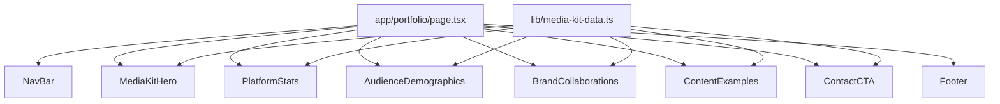

# Design Document: Media Kit Page

## Overview

The Media Kit page is a new static, presentational route (`/portfolio`) for the saithsfuff website. It serves as a professional portfolio aimed at brand representatives and potential collaborators, displaying platform statistics, audience demographics, past collaborations, content examples, and a contact call-to-action.

The page is a purely client-rendered, component-based layout with no dynamic data fetching — all content uses hardcoded placeholder data. It reuses the existing NavBar, design system (pastel colors, glass-card effects, decorative sparkles), and dark mode support. No database integration or API calls are required.

### Key Design Decisions

- **Static page with placeholder data**: All stats, demographics, brand logos, and content examples are hardcoded in a constants file for easy future replacement.
- **Component-per-section architecture**: Each logical section (Hero, Stats, Demographics, Brands, Content Examples, Contact) is its own React component for readability and maintainability.
- **Reuse of existing design primitives**: The page leverages `glass-card`, `whimsical-card`, `section-container`, `sparkle-divider`, `gradient-text`, and the pastel color palette already defined in globals.css and tailwind.config.ts.
- **Server component by default**: The page and its section components are React Server Components (no interactivity needed), keeping the bundle lean.

## Architecture



The page file (`app/portfolio/page.tsx`) acts as a simple composition root, importing and arranging section components vertically. A shared data file (`lib/media-kit-data.ts`) exports typed placeholder constants consumed by each section component.

## Components and Interfaces

### Page Route

**File:** `app/portfolio/page.tsx`

```typescript
// Server Component — composes all media kit sections
export default function MediaKitPage() {
  return (
    <>
      <NavBar />
      <main>
        <MediaKitHero />
        <PlatformStats />
        <AudienceDemographics />
        <BrandCollaborations />
        <ContentExamples />
        <ContactCTA />
      </main>
      <footer>...</footer>
    </>
  );
}
```

### NavBar Update

**File:** `components/NavBar.tsx`

Replace the existing `navLinks` array — remove all anchor-link entries (About, Instagram, TikTok) and keep only full-page routes. Rename "Media Kit" to "Portfolio" for a cleaner label:

```typescript
const navLinks = [
  { label: "Home", href: "/" },
  { label: "Portfolio", href: "/portfolio" },
];
```

### Section Components

All section components live in `components/media-kit/`:

| Component | File | Purpose |
|-----------|------|---------|
| `MediaKitHero` | `components/media-kit/MediaKitHero.tsx` | Headline, tagline, profile image with gradient background |
| `PlatformStats` | `components/media-kit/PlatformStats.tsx` | Glass-card grid showing Twitch/Instagram/TikTok metrics |
| `AudienceDemographics` | `components/media-kit/AudienceDemographics.tsx` | Age, gender, geography, interests with visual bars |
| `BrandCollaborations` | `components/media-kit/BrandCollaborations.tsx` | Responsive grid of brand logo/name cards |
| `ContentExamples` | `components/media-kit/ContentExamples.tsx` | Grid of content cards with thumbnail, title, platform, views |
| `ContactCTA` | `components/media-kit/ContactCTA.tsx` | Email, social links, prominent CTA button |

### Component Props / Interfaces

Each section component reads directly from the shared data file (no props needed since data is static). The data file exports typed constants:

```typescript
// lib/media-kit-data.ts

export interface PlatformStat {
  platform: string;
  icon: string; // emoji or icon identifier
  followers: string;
  engagementRate: string;
  avgViews: string;
}

export interface DemographicAge {
  range: string;
  percentage: number;
}

export interface DemographicGender {
  label: string;
  percentage: number;
}

export interface DemographicLocation {
  country: string;
  percentage: number;
}

export interface BrandCollab {
  name: string;
  logoPlaceholder: string; // emoji or text placeholder
  category: string;
}

export interface ContentExample {
  title: string;
  platform: string;
  views: string;
  thumbnailColor: string; // Tailwind bg class for placeholder thumbnail
}

export interface ContactInfo {
  email: string;
  socialLinks: { platform: string; url: string; label: string }[];
}
```

## Data Models

No database models are needed. All data is static placeholder content defined in `lib/media-kit-data.ts`.

### Placeholder Data Structure

```typescript
// Placeholder platform stats
export const platformStats: PlatformStat[] = [
  { platform: "Twitch", icon: "🎮", followers: "45.2K", engagementRate: "8.3%", avgViews: "1.2K" },
  { platform: "Instagram", icon: "📸", followers: "28.7K", engagementRate: "5.1%", avgViews: "3.4K" },
  { platform: "TikTok", icon: "🎵", followers: "62.1K", engagementRate: "12.7%", avgViews: "18.5K" },
];

// Placeholder demographics
export const ageBreakdown: DemographicAge[] = [
  { range: "18-24", percentage: 42 },
  { range: "25-34", percentage: 35 },
  { range: "35-44", percentage: 15 },
  { range: "45+", percentage: 8 },
];

export const genderDistribution: DemographicGender[] = [
  { label: "Female", percentage: 58 },
  { label: "Male", percentage: 36 },
  { label: "Other", percentage: 6 },
];

export const topLocations: DemographicLocation[] = [
  { country: "United States", percentage: 45 },
  { country: "United Kingdom", percentage: 18 },
  { country: "Canada", percentage: 12 },
  { country: "Australia", percentage: 8 },
  { country: "Germany", percentage: 5 },
];

export const audienceInterests: string[] = [
  "Gaming", "Beauty & Fashion", "Music", "Technology", "Lifestyle"
];

// Placeholder brand collaborations
export const brandCollaborations: BrandCollab[] = [
  { name: "Cozy Gaming Co.", logoPlaceholder: "🎮", category: "Gaming" },
  { name: "Pastel Beauty", logoPlaceholder: "💄", category: "Beauty" },
  { name: "CloudSnack", logoPlaceholder: "☁️", category: "Food & Beverage" },
  { name: "Neon Threads", logoPlaceholder: "👕", category: "Fashion" },
  { name: "PixelPerfect", logoPlaceholder: "📱", category: "Tech" },
  { name: "DreamStream", logoPlaceholder: "🌙", category: "Lifestyle" },
];

// Placeholder content examples
export const contentExamples: ContentExample[] = [
  { title: "Cozy Gaming Setup Tour", platform: "TikTok", views: "124K", thumbnailColor: "bg-pink-200" },
  { title: "Morning Routine GRWM", platform: "Instagram", views: "45K", thumbnailColor: "bg-lavender-200" },
  { title: "Brand Unboxing & Review", platform: "TikTok", views: "89K", thumbnailColor: "bg-mint-200" },
  { title: "Stream Highlights Reel", platform: "Twitch", views: "32K", thumbnailColor: "bg-pink-100" },
];

// Placeholder contact info
export const contactInfo: ContactInfo = {
  email: "collabs@saithsfuff.example",
  socialLinks: [
    { platform: "Twitch", url: "#", label: "twitch.tv/saithsfuff" },
    { platform: "Instagram", url: "#", label: "@saithsfuff" },
    { platform: "TikTok", url: "#", label: "@saithsfuff" },
  ],
};
```

## Error Handling

Since the page is entirely static with no data fetching, API calls, or user input:

- **No runtime errors expected**: All data is hardcoded; no network failures, validation errors, or data loading states to handle.
- **Image fallbacks**: The hero profile image uses a placeholder div with a gradient background as fallback if no image file exists.
- **Missing route handling**: Next.js App Router handles 404s natively if the route file doesn't exist — no custom error boundary needed for this page.
- **Dark mode**: Handled via Tailwind's `dark:` variants, inheriting the existing theme toggle behavior from the layout.

## Testing Strategy

### Why Property-Based Testing Does Not Apply

This feature is a **static presentational page** with:
- No data transformations or business logic
- No user input processing or form handling
- No parsers, serializers, or algorithms
- No dynamic data fetching

All content is hardcoded placeholder data rendered as markup. The acceptance criteria focus on UI rendering, layout, and visual consistency — categories where property-based testing provides no value. Example-based unit tests and visual/integration tests are the appropriate strategies.

### Testing Approach

**Unit Tests (Component rendering)**:
- Verify each section component renders expected placeholder content (text, numbers, labels)
- Verify NavBar contains only "Home" and "Portfolio" links (no anchor links)
- Verify correct number of items rendered (e.g., 3 platform stats, 4+ brand cards, 3+ content cards)
- Verify section heading text and structure

**Integration Tests (Page-level)**:
- Render the full `/portfolio` page and verify all sections are present
- Verify dark mode class application changes styling appropriately
- Verify responsive layout breakpoints (grid columns at different widths)

**Visual / Snapshot Tests**:
- Snapshot the rendered page to catch unintended layout regressions
- Verify glass-card and decorative element classes are applied

**Accessibility Tests**:
- Verify all images have appropriate alt text
- Verify heading hierarchy (h1 → h2 → h3)
- Verify color contrast meets WCAG 4.5:1 (already guaranteed by the design system's `text-dark` and `text-body` colors)
- Verify landmark regions and semantic HTML

**Manual Testing**:
- Visual review of light/dark mode appearance
- Review on mobile (320px), tablet (768px), and desktop (1280px+) viewports
- Verify decorative elements (sparkles, stars) render correctly
