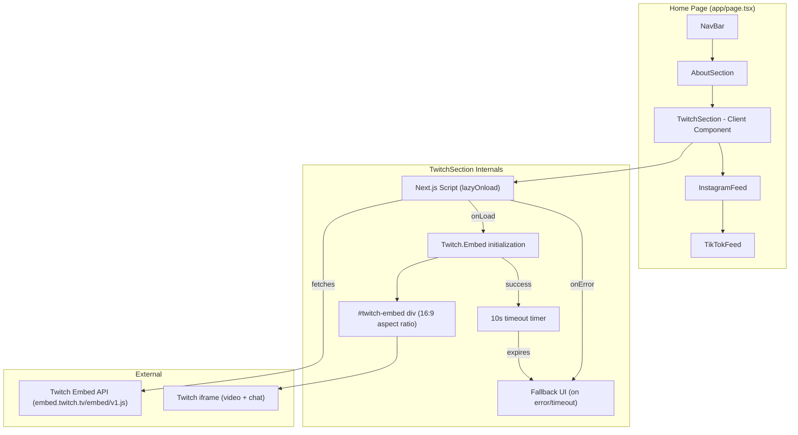

# Design Document: twitch-stream-viewer

## Overview

This design document describes the technical architecture for adding a Twitch stream viewer section to the saithsfuff.com homepage. The section embeds the live Twitch stream (with chat) for the "saithsfuff" channel using the [Twitch Embed API](https://dev.twitch.tv/docs/embed/everything/), positioned between the About section and the Instagram feed.

**Key Design Decisions:**

1. **Twitch Embed "Everything" API** — We use the "Embed Everything" approach (`https://embed.twitch.tv/embed/v1.js`) which provides both the video player and Twitch Chat in a single iframe. This gives viewers the full interactive experience (watch, chat, follow, subscribe) without leaving the site.

2. **Client Component with Dynamic Script Loading** — The TwitchSection component uses `"use client"` and loads the Twitch embed script lazily via Next.js `Script` component with `strategy="lazyOnload"`. This avoids blocking the initial page render while still providing the embed functionality.

3. **Iframe-based Embed with `parent` Parameter** — Twitch requires a `parent` parameter specifying the domain hosting the embed. We dynamically read `window.location.hostname` at runtime to satisfy this requirement across development and production environments.

4. **Timeout-based Fallback** — If the Twitch embed script fails to load or doesn't initialize within 10 seconds, the component renders a fallback message with a direct link to the Twitch channel page.

5. **Consistent Section Pattern** — The component follows the exact same structural pattern as InstagramFeed and TikTokFeed: section heading → whimsical-card wrapper → embed content → channel link.

## Architecture



### Component Lifecycle

1. **Mount**: Component renders the section structure with a placeholder `div#twitch-embed` and starts a 10-second timeout timer.
2. **Script Load**: The Twitch embed script loads lazily after the page is interactive.
3. **Initialization**: On script load, `new Twitch.Embed()` is called with the channel name, parent domain, layout, and sizing options.
4. **Success**: The Twitch iframe renders inside the placeholder div. The timeout timer is cleared.
5. **Failure**: If the script fails to load (`onError`) or the timeout expires before initialization, the fallback UI replaces the placeholder.

## Components and Interfaces

### New Component

#### `components/home/TwitchSection.tsx` — Twitch Stream Section (Client Component)

```typescript
"use client";

// Props: none (channel is hardcoded to "saithsfuff")
// State:
//   - embedStatus: "loading" | "ready" | "error"
//
// Behavior:
//   - Renders section with heading, whimsical-card wrapper, embed container, and channel link
//   - Loads Twitch embed script via Next.js Script (strategy="lazyOnload")
//   - On script load: initializes Twitch.Embed with channel, parent, layout, dimensions
//   - On script error or 10s timeout: shows fallback UI
//   - Sets iframe title attribute for accessibility after embed renders

interface TwitchEmbedOptions {
  width: string;        // "100%"
  height: string;       // "100%"
  channel: string;      // "saithsfuff"
  layout: string;       // "video-with-chat"
  parent: string[];     // [window.location.hostname]
  autoplay: boolean;    // false (don't autoplay to avoid unwanted audio)
  muted: boolean;       // true (start muted for better UX)
}
```

### Modified File

#### `app/page.tsx` — Home Page

Add `TwitchSection` import and render it between `AboutSection` and `InstagramFeed`:

```typescript
import TwitchSection from "@/components/home/TwitchSection";

export default function Home() {
  return (
    <>
      <NavBar />
      <main>
        <AboutSection />
        <TwitchSection />
        <InstagramFeed />
        <TikTokFeed />
      </main>
      <footer>...</footer>
    </>
  );
}
```

### TypeScript Declarations

The Twitch Embed API adds a global `Twitch` object. We need a type declaration:

```typescript
// types/twitch.d.ts
declare namespace Twitch {
  class Embed {
    constructor(elementId: string, options: {
      width?: number | string;
      height?: number | string;
      channel?: string;
      layout?: "video-with-chat" | "video";
      parent?: string[];
      autoplay?: boolean;
      muted?: boolean;
      theme?: "light" | "dark";
    });

    addEventListener(event: string, callback: () => void): void;
    getPlayer(): unknown;

    static VIDEO_READY: string;
    static VIDEO_PLAY: string;
  }
}
```

## Data Models

This feature has no data models. It is a purely client-side component that loads an external embed script. No database tables, API routes, or server-side data fetching are required.

**Configuration:**
- Channel name: `"saithsfuff"` (hardcoded constant)
- Channel URL: `"https://www.twitch.tv/saithsfuff"` (hardcoded constant)
- Timeout duration: `10000` ms (hardcoded constant)
- Parent domain: derived from `window.location.hostname` at runtime

## Error Handling

| Scenario | Detection Method | Behavior |
|----------|-----------------|----------|
| Twitch embed script fails to load (network error, blocked by ad blocker) | `Script` component `onError` callback | Set `embedStatus` to `"error"`, render fallback UI |
| Twitch embed script loads but initialization times out (>10s) | `setTimeout` timer started on mount | Set `embedStatus` to `"error"`, render fallback UI |
| Twitch embed loads successfully | `Twitch.Embed.VIDEO_READY` event or iframe appears in container | Clear timeout, set `embedStatus` to `"ready"` |
| JavaScript disabled in browser | N/A (component won't mount) | Section won't render; not a target scenario for this site |

**Fallback UI Content:**
- Message: "Stream unavailable right now — catch saithsfuff live on Twitch!"
- Direct link to `https://www.twitch.tv/saithsfuff` (opens in new tab)
- Styled consistently with the whimsical-card aesthetic

## Correctness Properties

### Property 1: Embed Container Aspect Ratio Integrity

**Validates: Requirements 2.3, 3.2**

For any viewport width between 320px and 1440px, the Twitch embed container SHALL maintain a 16:9 aspect ratio (height = width × 9/16 ± 1px rounding tolerance). This ensures the embed renders without letterboxing or content clipping at all supported viewport sizes.

### Property 2: Fallback Determinism

**Validates: Requirements 1.5, 3.4**

For any failure scenario (script load error OR timeout expiration after 10 seconds without VIDEO_READY event), the component SHALL transition to the "error" state exactly once and render the fallback UI containing a direct link to https://www.twitch.tv/saithsfuff. The component SHALL NOT oscillate between loading and error states.

## Testing Strategy

Property-based testing is **not applicable** for this feature. The component is a UI rendering layer that embeds a third-party player with fixed configuration. There are no pure functions with variable inputs, no data transformations, and no universal properties that would benefit from randomized input generation. All acceptance criteria involve fixed DOM structure, specific CSS classes, and static attribute values.

### Unit Tests (Jest + React Testing Library)

Tests verify the component renders the correct DOM structure, attributes, and handles error states:

1. **Section placement**: Verify TwitchSection renders between AboutSection and InstagramFeed in the page component.
2. **Heading**: Verify the heading contains "Watch on Twitch" with `font-display`, `gradient-text`, correct size classes, and center alignment.
3. **Channel link**: Verify link has `href="https://www.twitch.tv/saithsfuff"`, `target="_blank"`, `rel="noopener noreferrer"`, and pink-500 styling.
4. **Channel link accessibility**: Verify link contains visually hidden "(opens in new tab)" text or equivalent aria-label.
5. **Section container**: Verify section element has `section-container` class.
6. **Whimsical card wrapper**: Verify embed is wrapped in element with `whimsical-card` class and responsive padding.
7. **Embed container**: Verify placeholder div exists with correct ID and 16:9 aspect ratio styling.
8. **Script loading**: Verify the Twitch embed script tag loads from `https://embed.twitch.tv/embed/v1.js` with lazy strategy.
9. **Fallback on error**: Simulate script load failure, verify fallback message renders with direct Twitch link.
10. **Fallback on timeout**: Simulate 10-second timeout expiration, verify fallback renders.
11. **Iframe accessibility**: After successful embed, verify iframe has `title="saithsfuff Twitch stream player"` and is keyboard-reachable.

### Integration Tests

- **Page rendering**: Verify the full home page renders all sections in correct order with Twitch section present.
- **Responsive layout**: Visual checks at 320px, 768px, and 1440px confirming the embed container fills its parent and maintains 16:9 ratio.

### Manual Testing

- Verify embed loads on production domain (parent parameter validation).
- Verify embed shows live stream when channel is live and offline state when not.
- Test with ad blockers to confirm fallback renders gracefully.
- Keyboard navigation through the embed iframe.
